# 云电脑 + 训推平台 使用指南（零经验版）

> **适用对象**：完全没有赛事平台 / 云电脑 / Docker / 远程训练经验的队员。
> 每一步都写明「**在哪里 → 点什么 → 应该看到什么**」。
>
> **依据资料**：`平台使用方法.mp4`、`云电脑平台使用指南V1.0.docx`、
> `训推平台使用指南V1.0.docx`、`赛事管理平台使用指南V2.0.docx`。
> 文中截图取自上述官方文档与视频（见 `docs/platform_images/`）。
>
> ⚠️ 平台界面会迭代，**按钮文案以你实际看到的为准**；本指南给的是操作路径与判断标准。

---

## 0. 先读这一节：建立全景认知

### 0.1 三个环境，各干什么

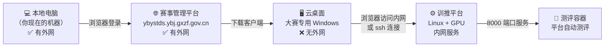
```mermaid
flowchart LR
    A["💻 本地电脑<br/>（你现在的机器）<br/>✅ 有外网"] -->|"浏览器登录"| B["🌐 赛事管理平台<br/>ybystds.ybj.gxzf.gov.cn<br/>✅ 有外网"]
    B -->|"下载客户端"| C["🖥️ 云桌面<br/>大赛专用 Windows<br/>❌ 无外网"]
    C -->|"浏览器访问内网<br/>或 ssh 连接"| D["⚙️ 训推平台<br/>Linux + GPU<br/>内网服务"]
    D -->|"8000 端口服务"| E["🎯 测评容器<br/>平台自动测评"]
```

| 环境 | 是什么 | 能否上网 | 你在这里做什么 |
|---|---|---|---|
| **本地电脑** | 你自己的电脑 | ✅ 有外网 | 看文档、下客户端、写代码 |
| **赛事管理平台** | 大赛官网后台 | ✅ 有外网 | 报名、申请资源、发起测评、下载文件 |
| **云桌面** | 大赛专用 Windows 虚拟机 | ❌ **无外网，禁止下载数据** | 访问 Codeup（代码管理）、**访问训推平台**、SSH 到容器 |
| **训推平台** | **内网**平台（网页 + 容器） | 内网 | 创建容器实例、**跑训练**、跑推理、发起测评 |
| **测评容器** | 测评专用的容器实例 | — | 平台自动访问它的 8000 端口来打分 |

> **最容易踩的坑**：以为能在云桌面里下载数据或 pip install 外网包 —— **不行**。
> 云桌面没有外网；数据和模型都通过训推平台的"挂载"提供。

### 0.2 三个代码工程，各是什么

| 工程 | 角色 | 要不要放进容器 |
|---|---|---|
| `glioma_goals/` | **训练工程**：六个 Goal 各自或串行训练 | ✅ 要（在容器里训） |
| `glioma_track4/` | **算法工程**：数据管线、自研推理、全流程脚本 | ✅ 要（训练依赖它的数据管线与折划分） |
| `Glioma_recognition-main/` | **提交工程**：Docker 镜像主体、官方规范接口基线 | ✅ 要（镜像主体；启动命令见 §5.2） |

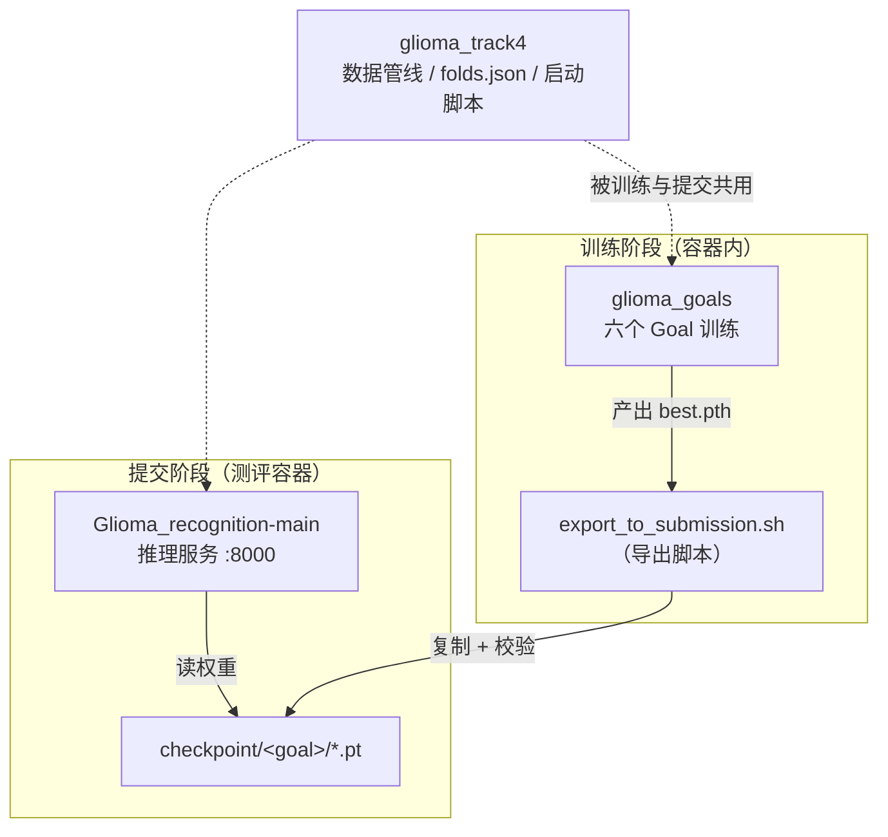
```mermaid
flowchart TB
    subgraph train["训练阶段（容器内）"]
        G["glioma_goals<br/>六个 Goal 训练"] -->|"产出 best.pth"| E["export_to_submission.sh<br/>（导出脚本）"]
    end
    subgraph submit["提交阶段（测评容器）"]
        R["Glioma_recognition-main<br/>推理服务 :8000"] -->|"读权重"| W["checkpoint/&lt;goal&gt;/*.pt"]
    end
    E -->|"复制 + 校验"| W
    T["glioma_track4<br/>数据管线 / folds.json / 启动脚本"] -.->|"被训练与提交共用"| G
    T -.-> R
```

> **为什么不合并**：规范 §5.2 要求"权重不放在代码仓库"，§5.1 要求
> "`[研发]` 文件不得被比赛运行入口传递导入"。靠一个导出脚本 + 一份同源校验衔接
> （见 `scripts/26_audit_plugin_completeness.py`）。

> ⚠️ **"镜像主体"不等于"启动命令"，两者别混着用**：
> - 测评容器的启动命令见 **§5.2**，跑的是 `glioma_track4/scripts/06_platform_serve.sh`
>   （glioma_track4 的服务，**默认就是真实模型**，不需要任何环境变量）。
> - 提交工程里也有一个服务（`start.sh` → `app.server:app`，Docker 镜像的默认入口），
>   但它按官方规范**默认跑 Dummy 基线**：接口格式正确、却没有真实模型输出，
>   必须显式设置 `COMPETITION_PIPELINE_FACTORY` 才切到真实插件
>   （候选值见 `configs/competition.env.example`，两个工厂：
>   `tasks.real_pipeline:build_pipeline` 为目标架构，`tasks.glioma.pipeline:build_pipeline`
>   为用 glioma_track4 权重的过渡桥接）。
> - 也就是说：**把启动命令改成 `start.sh` 时必须同时带上那个环境变量**，否则就是
>   "服务一切正常、答案没有意义"的静默失败。启动日志里会打印
>   `[registry] ⚠️ ... Dummy 基线` / `[registry] ✓ 真实插件工厂已加载: ...` 供核对。

### 0.3 存储布局（决定你把东西放哪）

容器里能看到的目录（训推平台自动挂载）：

```
/2026aicompetition/
├── public_models/              ← 公共模型（只读，40+ 基线模型）
├── datasets/ 或 public_dataset_<赛道>/   ← 公共数据集（只读）
│
└── workspace/                  ← 【我的存储】读写 + 持久
    ├── answer/                 ← 平台默认：推理结果
    ├── train_model/            ← 平台默认：训练模型
    ├── common/                 ← 平台默认：自定义
    ├── dcs/                    ← 建议：把三个工程的代码放这里
    │   ├── glioma_goals/
    │   ├── glioma_track4/
    │   └── Glioma_recognition-main/
    └── checkpoint/             ← 规范 §5.2：提交用权重的固定位置
        ├── goal1_authenticity/model.pt
        ├── goal2_stitched/model.pt
        ├── goal2_duplicate/encoder.pt
        ├── goal3_tumor/model.pt
        ├── goal4_diagnosis/model.pt
        └── goal5_segmentation/{core.pt,flair.pt}
```

> ⚠️ **容器实例删除后，容器内的数据会清除**。代码、权重、`folds.json`
> 必须放在 `/2026aicompetition/workspace/` 下（私有存储，持久保留）。

### 0.4 从零到提交：8 步总览

| 步 | 在哪做 | 做什么 | 预计耗时 |
|---|---|---|---|
| 1 | 赛事管理平台 | 报名通过 → 申请资源 → 下载云桌面客户端 | 10 分钟 |
| 2 | 本地电脑 | 装云桌面客户端并登录 | 10 分钟 |
| 3 | 云桌面 | 浏览器进**训推平台**，创建容器实例 | 5 分钟 |
| 4 | 训推平台 | 创建**训练用**容器实例（挂载存储） | 5 分钟 |
| 5 | 容器内 | 放代码 → 装依赖 → 跑训练 | 数小时~数天 |
| 6 | 容器内 | 导出权重到 `checkpoint/` | 1 分钟 |
| 7 | 训推平台 | 创建**测评容器**（开 8000 + /health） | 5 分钟 |
| 8 | 赛事管理平台 | 发起验证测评 → 确认无误 → 发起初赛测评 | 10 分钟 |

---

## 1. 第 1 步：赛事管理平台 —— 拿资源、下客户端

### 1.1 登录与确认报名

浏览器打开 `https://ybystds.ybj.gxzf.gov.cn:30037` → 登录 → 进入 **个人工作台**：

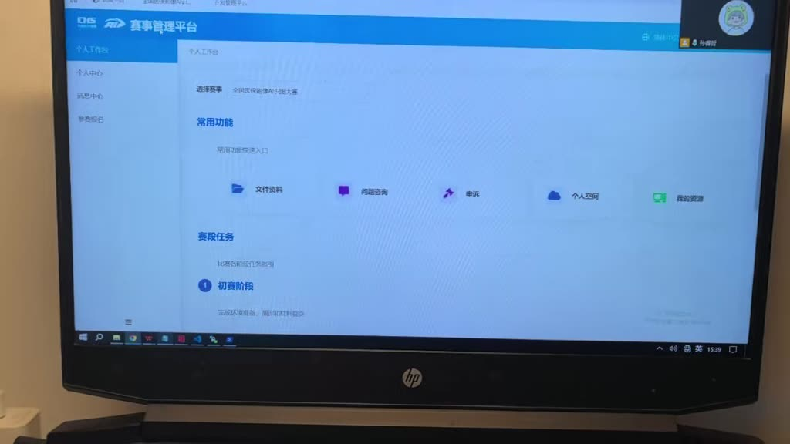

> 看不到「初赛阶段」说明报名还没审核通过 —— 先去「问题咨询」问一下。

### 1.2 下载云桌面客户端

**路径**：个人工作台 → 常用功能 → **文件资料**

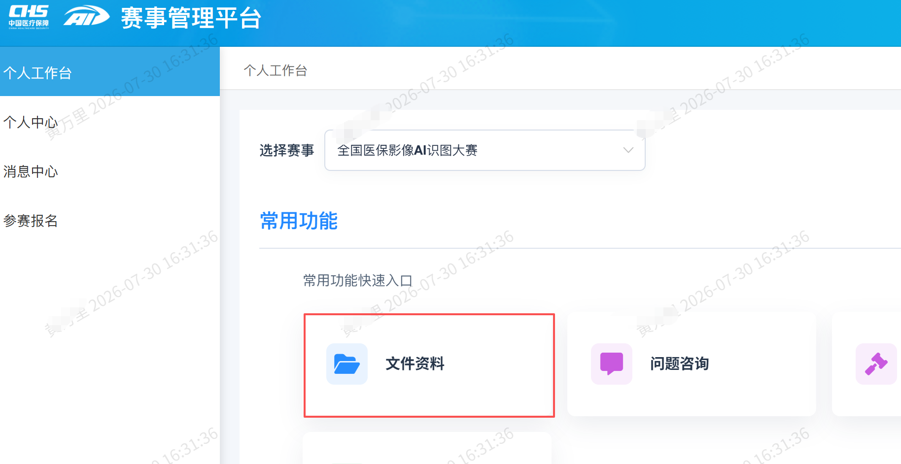

| 你的电脑 | 下载哪个 | 注意 |
|---|---|---|
| Windows | `AiCompetition_Desktop_1.6.9.59.2607_win.exe` | **仅支持 Win10 以上** |
| Mac | `AiCompetition_Desktop_2.0.1.23_2607_mac.zip` | **仅支持 Apple M1-M5 芯片** |

### 1.3 申请资源

**路径**：个人工作台 → 常用功能 → **我的资源** → 资源申请
（申请算力资源 / 云桌面 / 存储资源）

> **账号密码只有一个**：赛事管理平台的账号密码，与云桌面客户端登录**完全一致**。

---

## 2. 第 2 步：云桌面 —— 你的"跳板机"

### 2.1 安装前的两个准备

| 准备 | 怎么做 | 为什么 |
|---|---|---|
| **关闭安全软件** | 完全退出 360、各类杀毒软件 | 会拦截安装包、阻断程序运行 |
| **改用有线网络** | 网线直连，不要用 WiFi / 热点 | 无线易丢包断连 |

另外：**不要开 VPN / 代理**。连通性自检：浏览器能打开 `https://ybystds.ybj.gxzf.gov.cn:30037`。

### 2.2 安装与登录

**① 安装**：双击 exe → 下一步 → 选安装目录 → 安装

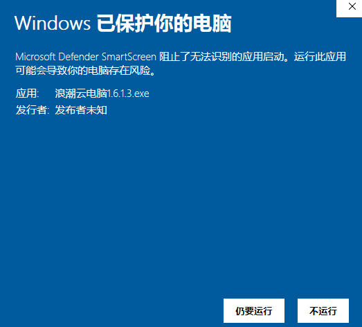

装完后桌面出现快捷方式：

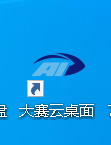

**② 填服务地址**：`https://ybystds.ybj.gxzf.gov.cn:30037` → 【下一步】

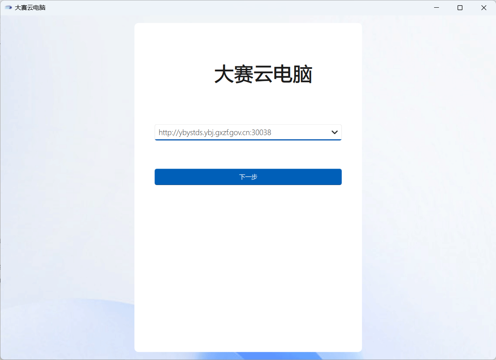

**③ 登录**：填赛事管理平台的账号密码 → 【登录】

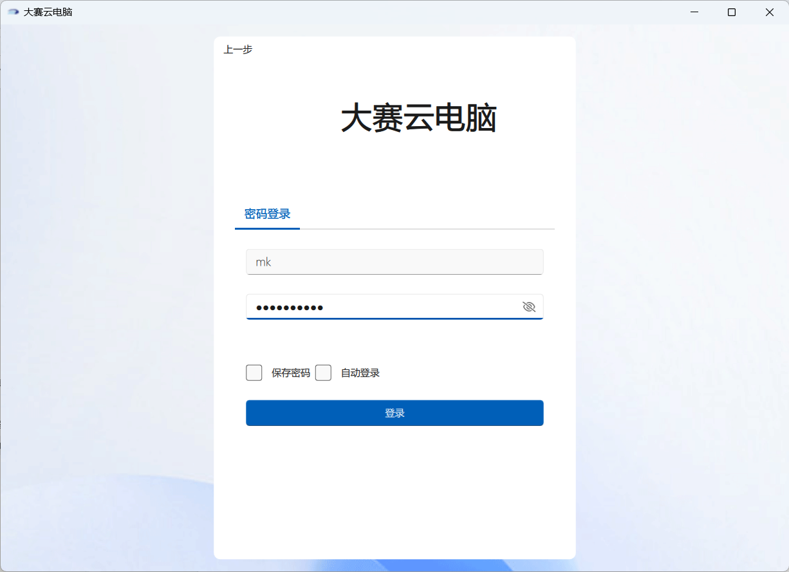

**④ 连接桌面**：桌面卡片页找到自己的桌面 → 【连接】

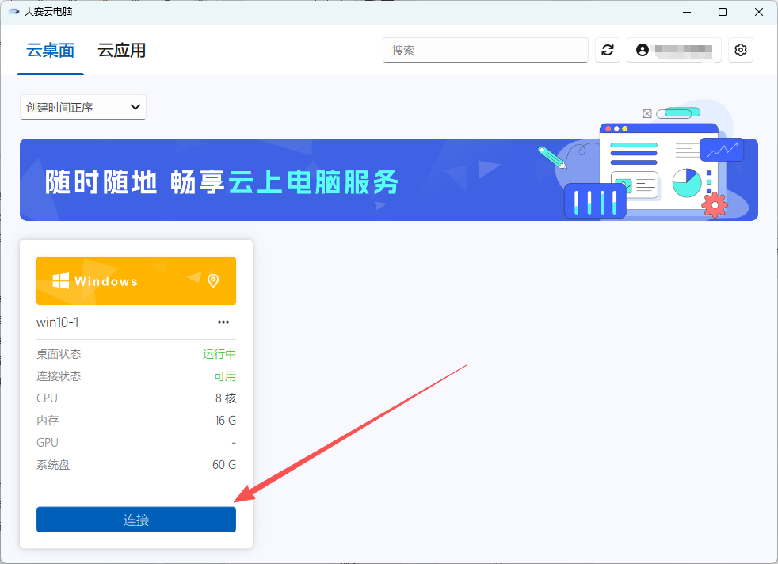

> **首次登录绑定需 5-10 秒**，看不到桌面就点右上角刷新。

### 2.3 日常操作

**开机**（显示"已关机"时）：

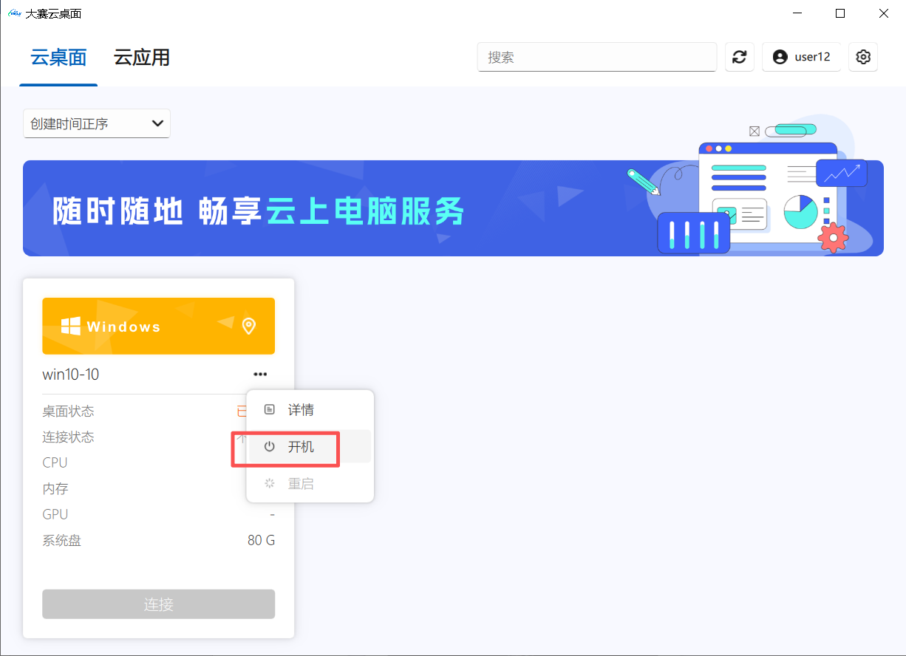

**工具栏（悬浮球）**：

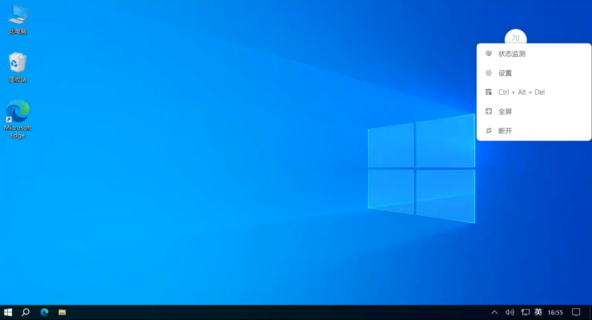

| 按钮 | 作用 |
|---|---|
| 状态监测 | 看延迟/丢包（**延迟 >200ms 或丢包 >50% 会断连**） |
| 还原 | 全屏 ↔ 窗口切换 |
| 断开 | 退出云桌面连接 |

> **锁屏密码**：`Admin@123`

---

## 3. 第 3 步：训推平台 —— 创建容器实例

### 3.0 训推平台在哪里？（**内网服务，必须从云桌面访问**）

> ⚠️ **这是最容易卡住的一步。**

| 问题 | 答案 |
|---|---|
| 能在家里电脑直接打开吗？ | **不能。** 训推平台是**内网服务**，只在云桌面所在网络内可达 —— 所以云桌面同时是你的"跳板机" |
| 平台的网址是什么？ | **三份官方指南里都没有写**（逐份核对过，只有云桌面服务地址 `https://ybystds.ybj.gxzf.gov.cn:30037`）。视频里浏览器标签显示它叫 **「开发管理平台」** |
| 那怎么找到它？ | 三条途径，见下 |

**获取入口的三条途径**（按可能性排序）：

1. **云桌面里的浏览器**（最可能）
   打开云桌面 → 浏览器 → 看**收藏夹 / 首页 / 历史记录**。
   视频里云桌面访问过 `ybystds.ybj.gxzf.gov.cn`（赛事平台）与
   `yunxiao.ybj.gxzf.gov.cn`（云效），训推平台与它们并列，通常就在同一个收藏夹。

2. **赛事管理平台的导航**
   登录赛事管理平台 → 看顶部/侧边导航是否有「开发管理平台」「训推平台」入口。

3. **问组委会**（最稳妥）
   赛事管理平台 → 常用功能 → **问题咨询** → 新增，直接问"训推平台入口地址"。

**怎么判断"进对了"** —— 左侧菜单应能看到这些：

```
AI资产   → 存储与数据服务（公共存储 / 我的存储）
AI开发   → 容器实例
AI资源   → 镜像仓库（基础镜像 / 自定义镜像仓库）
算力调度  → AI资产 → 资源组 / 调度配置
```

只要这几个菜单在，就是训推平台，可以往下走。

### 3.1 认识两个存储页签

在 **AI资产 → 存储与数据服务**：

| 页签 | 内容 | 挂载权限 |
|---|---|---|
| **公共存储** | `public_dataset_<赛道>`（训练数据）、`public_model`（基线模型） | **只读** |
| **我的存储** | 你的私有空间（约 1000G），默认含 `answer`/`train_model`/`common` | **读写** |

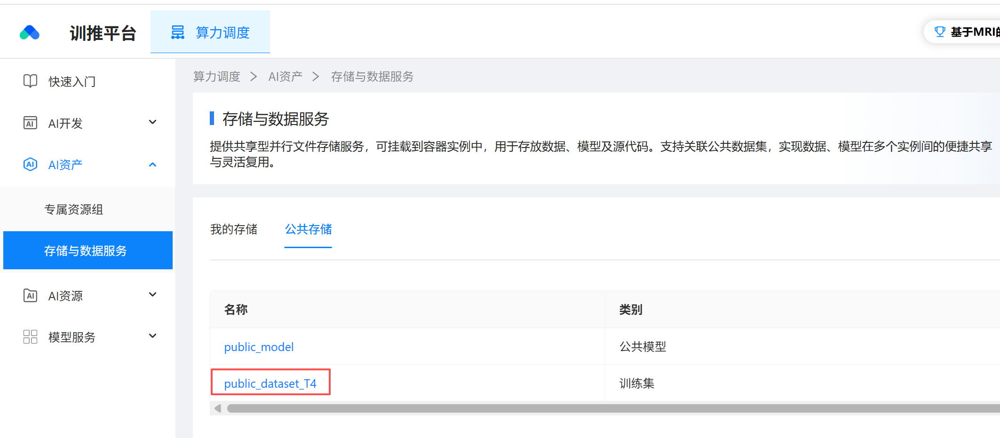

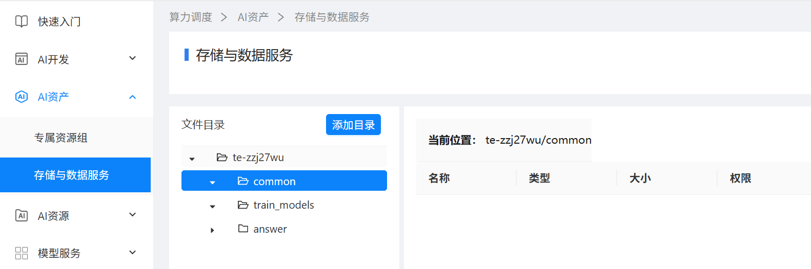

### 3.2 创建训练用容器实例

**路径**：**AI开发 → 容器实例 → 添加实例**

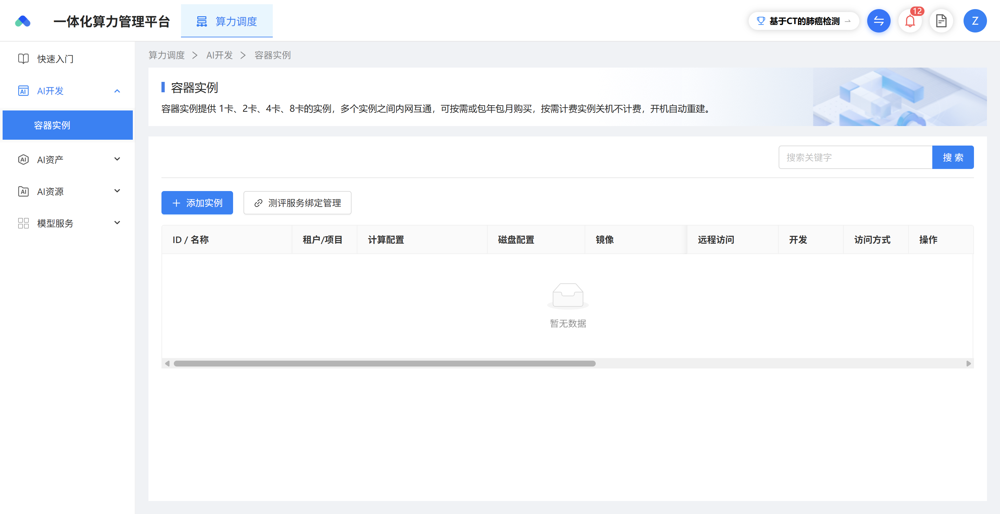

> ⚠️ **每支队伍在单个赛道内最多创建 4 个容器实例**。删除容器会清除容器内数据，
> 删之前务必确认代码和权重都在 `/2026aicompetition/workspace/`。

创建时重点填三处：

**① 镜像**（选基础镜像）

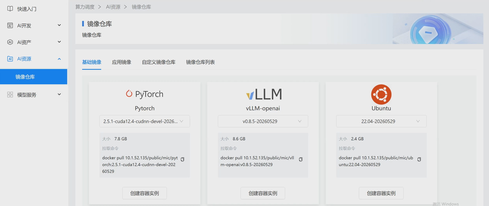

推荐 `pytorch:2.8.0-cuda12.8-cudnn9-runtime`（与本工程一致：CUDA 12.8 / cuDNN 9.x）。

**② 挂载存储**

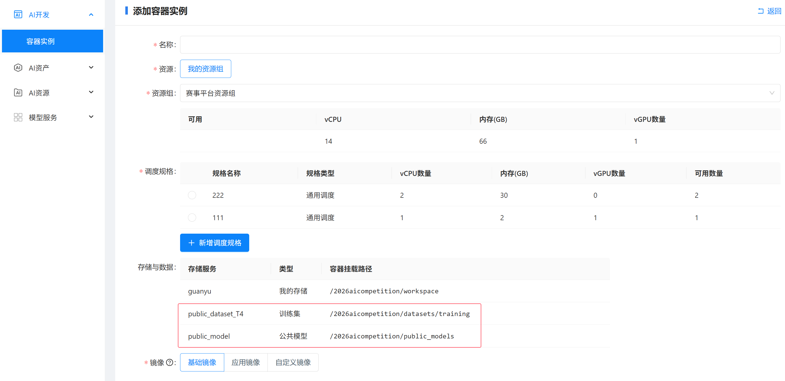

- 公共存储 → 只读挂载
- 我的存储 → 读写挂载，容器内路径 **`/2026aicompetition/workspace`**

**③ 算力规格**：可在 **算力调度 → AI资产 → 调度配置** 自定义

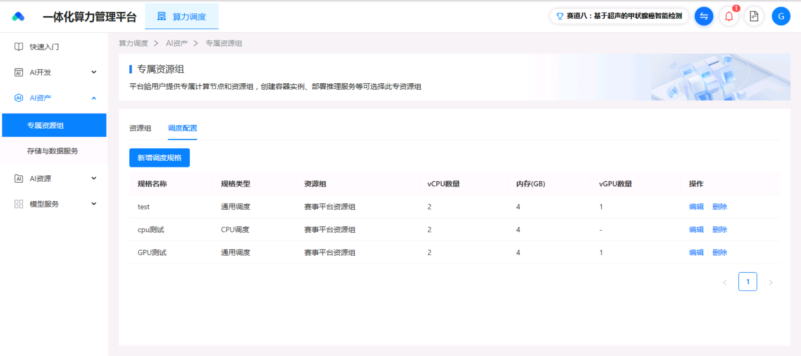

### 3.3 进入容器（两种方式）

实例状态变为「运行中」后：

**方式 A：Web 控制台**（最简单，推荐新手）

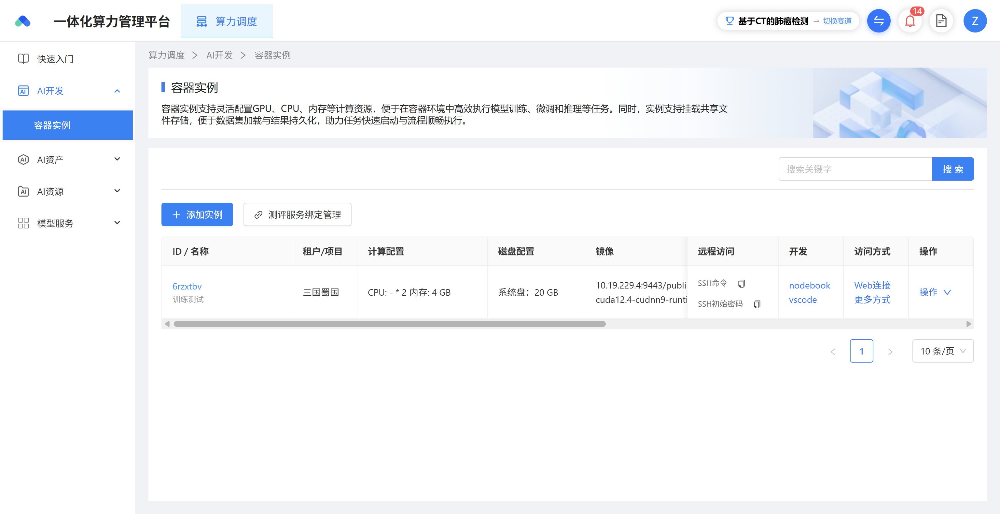

点【Web 连接】→ 浏览器里打开一个终端。

**方式 B：SSH**（视频里的方式，适合长时间操作）

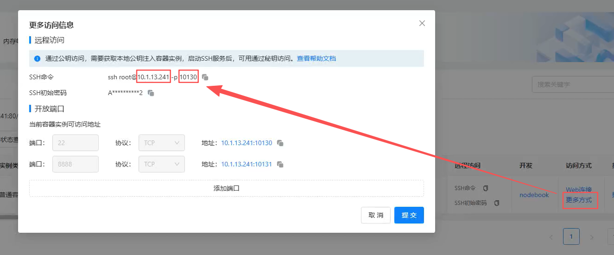

点 **访问方式 → 更多方式**，复制：
- 服务器 IP 与端口（形如 `10.13.1.23` 和 `241`）
- SSH 初始密码

然后任选一种客户端连接：

```bash
# ① 命令行
ssh -p 241 root@10.13.1.23        # 首次输入 yes，再粘贴初始密码

# ② Windows 上的 SSH 工具（视频里用的是 WindTerm）
#    新建会话 → 协议 SSH → 主机 10.13.1.23 → 端口 241 → 用户 root → 密码

# ③ VSCode：安装 Remote-SSH 插件 → 填同样的 IP/端口/密码
```

> 💡 **视频里的做法**：在**云桌面**里打开 WindTerm，连 `10.13.1.23:241`，
> 登录后进入 `/2026aicompetition/workspace/dcs/Glioma_recognition` 装依赖。
> 你也可以在自己电脑上 ssh（前提是网络能路由到该 IP）。

### 3.4 把代码放进容器

#### 先分清两个概念（最容易混淆的一步）

| | Codeup | 容器的 `/2026aicompetition/workspace/` |
|---|---|---|
| 是什么 | **代码托管平台**（云效） | 训推平台的**持久存储** |
| 里面的代码能跑吗 | ❌ 不能，它只是"仓库" | ✅ 能，训练/推理都在这里跑 |
| 谁负责 | 你在云桌面里操作 | 你在容器里操作 |

> **"我要的代码在 Codeup 里了"不等于"容器里有了"。**
> 两者之间要靠 **`git clone`** 打通 —— 就像 GitHub 上的代码，
> 你必须 clone 到本地才能跑。

#### 操作总览

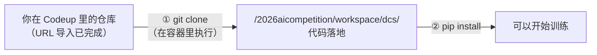
```mermaid
flowchart LR
    A["你在 Codeup 里的仓库<br/>（URL 导入已完成）"] -->|"① git clone<br/>（在容器里执行）"| B["/2026aicompetition/workspace/dcs/<br/>代码落地"]
    B -->|"② pip install"| C["可以开始训练"]
```

#### 步骤 ①：在 Codeup 取「克隆地址」

云桌面 → **代码管理 Codeup** → 进入你的代码库 → 右上角 **「克隆 / 下载」** → 复制 **HTTPS 地址**。

形如：`https://yunxiao.ybj.gxzf.gov.cn/codeup/<项目名>/<库名>.git`

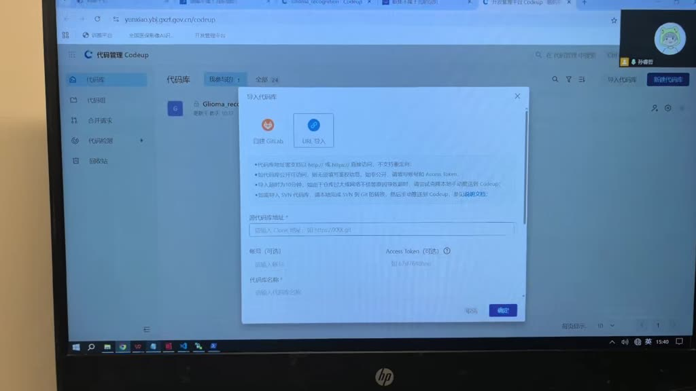

#### 步骤 ②：在容器里 clone（**方案 A，首选**）

```bash
# 0) 先测容器能不能访问 Codeup（不通就直接走方案 B）
curl -sI https://yunxiao.ybj.gxzf.gov.cn/codeup/ | head -1
#    返回 HTTP/1.1 200 或 302 说明能访问

# 1) 建目录（**必须在 workspace 下**，否则删容器就丢）
mkdir -p /2026aicompetition/workspace/dcs
cd /2026aicompetition/workspace/dcs

# 2) 克隆（把下面地址换成你复制的）
git clone https://yunxiao.ybj.gxzf.gov.cn/codeup/<项目名>/<库名>.git

#    想改目录名（例如让目录就叫 glioma_goals）：
git clone https://.../xxx.git glioma_goals
```

**需要认证时怎么填**：

| 字段 | 填什么 |
|---|---|
| 用户名 | Codeup 账号 / 邮箱；**只有 Token 时随便填个非空值**（见下） |
| 密码 | **Token**（个人访问令牌），**不是登录密码** |

**只有 Token、没有账号密码时**（很常见：云桌面里是登录态，但容器里需要凭据）：

Codeup 的 HTTPS 克隆支持"用户名 + 令牌"，**Token 认证时不校验用户名**，
因此用户名填任意非空值即可。推荐**交互式**输入（Token 不会留在 shell 历史里）：

```bash
git clone https://yunxiao.ybj.gxzf.gov.cn/codeup/<项目名>/<库名>.git
# Username: oauth2            ← 随便填非空值
# Password: <粘贴 Token>       ← 输入时不显示，正常
```

或一次性写进 URL（**注意会留在 shell 历史里，公用机器别这么干**）：

```bash
git clone https://oauth2:<你的Token>@yunxiao.ybj.gxzf.gov.cn/codeup/<项目名>/<库名>.git
```

**认证失败时的试错顺序**（不同部署对用户名字段要求不同）：

1. 用户名 `oauth2`，密码填 Token
2. 用户名填你的 Codeup 登录名或邮箱，密码填 Token
3. 用户名填 Token，密码留空
4. 都不行 → 用下面的**「零凭据方案」**

**Token 在哪拿**：Codeup → 右上角头像 → **个人设置 → 访问令牌（Access Token）** → 新建（勾 `repo` 读权限即可）。

**不想每次输入**（可选）：

```bash
git config --global credential.helper store     # 首次输入后记住
```

> 若提示 `git: command not found`：
> `apt-get update && apt-get install -y git`（pytorch 官方镜像基于 Ubuntu）

#### 零凭据方案：网页下载 ZIP（**完全不需要 Token**）

云桌面里的浏览器**已经是登录状态**，所以可以直接下载代码压缩包：

1. Codeup → 进入代码库 → 右上角 **「克隆 / 下载」→ 下载 ZIP**
2. 把 ZIP 从云桌面传到容器，再解压：

```bash
# ① 在【云桌面】里执行（IP/端口取自容器实例 → 访问方式 → 更多方式）
scp -P 241 <库名>.zip root@10.13.1.23:/2026aicompetition/workspace/dcs/

# ② 回到【容器】里解压
cd /2026aicompetition/workspace/dcs
apt-get update && apt-get install -y unzip
unzip <库名>.zip && rm <库名>.zip
```

> **取舍**：ZIP 里**没有 `.git` 目录**，后续更新要重新下载；
> 但它**不需要任何凭据**，在 Token 不好使时是最省事的路子。
> 长期维护还是建议用 Token + `git pull`。

#### 步骤 ③：容器访问不了 Codeup 时（**方案 B：云桌面中转**）

云桌面既能访问 Codeup，又能 SSH 进容器 —— 让它当中转站：

```bash
# ① 在【云桌面】里 clone 并打包
git clone https://yunxiao.ybj.gxzf.gov.cn/codeup/<项目名>/<库名>.git
tar czf code.tar.gz <库名>

# ② 从【云桌面】传到【容器】（IP/端口取自容器实例的「访问方式 → 更多方式」）
scp -P 241 code.tar.gz root@10.13.1.23:/2026aicompetition/workspace/dcs/

# ③ 回到【容器】里解包
cd /2026aicompetition/workspace/dcs
tar xzf code.tar.gz && rm code.tar.gz
```

#### 验证与后续更新

```bash
# 验证：应看到你的工程目录
ls -la /2026aicompetition/workspace/dcs/

# 后续代码有更新，拉最新
cd /2026aicompetition/workspace/dcs/<库名> && git pull
```

**建议的最终布局**（**务必放在 workspace 下**）：

```bash
/2026aicompetition/workspace/dcs/
├── glioma_goals/              # 训练工程
├── glioma_track4/             # 算法工程（数据管线 + folds.json + 脚本）
└── Glioma_recognition-main/   # 提交工程
```

> 若三个工程在 Codeup 里是**三个独立仓库**，就 clone 三次；
> 若是**一个仓库含三个目录**，clone 一次即可。

---

## 4. 第 5 步：在容器里跑训练（本工程实操）

### 4.0 一次性环境准备

```bash
# ① 进入代码目录
cd /2026aicompetition/workspace/dcs

# ② 装依赖
#    ⚠️ 测评容器的启动命令跑的是 **glioma_track4** 的服务（06_platform_serve.sh），
#       所以运行期依赖以 glioma_track4/requirements.txt 为准
#       （requests / pyyaml / scipy / SimpleITK / scikit-image / pandas 都在里面）。
cd /2026aicompetition/workspace/dcs/glioma_track4
bash scripts/00_setup_env.sh --mode system     # 自动沿用镜像自带 torch，只补缺失的包
#    · 手动等价写法：pip install -r glioma_track4/requirements.txt
#      （文件里有 torch>=2.4，镜像已带会被跳过，不会重装 2GB）
#    · Glioma_recognition-main/requirements.txt 只覆盖**提交工程自身**的轻量包
#      （Docker 镜像主体用），单装它**不足以**跑评测容器。
#    · 报 `Error: externally-managed-environment` → 见下方「装依赖报错怎么办」
cd /2026aicompetition/workspace/dcs


# ③ 让训练能用上统一折划分（关键！否则六个 Goal 的验证集各不相同）
mkdir -p /2026aicompetition/workspace/common
cp /2026aicompetition/workspace/dcs/glioma_track4/data/folds.json \
   /2026aicompetition/workspace/common/folds.json
export GLIOMA_FOLDS=/2026aicompetition/workspace/common/folds.json

# ④ 设置数据根
#    【已实测确认】容器内挂载的三个顶层目录：
#      /2026aicompetition/datasets         ← 数据集
#      /2026aicompetition/public_models    ← 公共模型（只读）
#      /2026aicompetition/workspace        ← 你的私有存储（读写 + 持久）
#
#    数据根填"含病例号目录的那一层"，或它的**上一层**（会自动下钻并打印告警）：
#      A) datasets/training/annotation/<病例号>/<序列>/*.nii.gz
#           → 数据根 = .../datasets/training/annotation（推荐）或 .../datasets/training（自动下钻）
#      B) datasets/<阶段>/<病例号>/<序列>/*.nii.gz   → 数据根 = .../datasets/<阶段>
#    ✗ datasets/ 本身（下面是多个阶段）会被 ValueError 拦住，不会猜错
ls /2026aicompetition/datasets/          # 先看下一层是什么
```

**用工程的 `discover_cases` 直接验证**（**能扫出非零病例数的那个就是数据根**）：

```bash
cd /2026aicompetition/workspace/dcs/glioma_goals
python -c "
import sys; sys.path.insert(0, '.')
from pathlib import Path
from shared.data import discover_cases
for cand in ['/2026aicompetition/datasets', '/2026aicompetition/datasets/training',
             '/2026aicompetition/datasets/training/annotation']:
    p = Path(cand)
    if not p.is_dir():
        print(f'{cand}  (不存在)'); continue
    cs = discover_cases(p)
    print(f'{cand}  ->  {len(cs)} 个病例  {[c[\"accession\"] for c in cs[:3]]}')
"
```

期望：某个路径输出几十/几百个病例，另一个输出 0 或不存在。

```bash
# 确认后写进 env 文件（免得每次重设），并按需 source
cat > /2026aicompetition/workspace/common/env.sh <<'EOF'
export GLIOMA_DATASET_ROOT=/2026aicompetition/datasets/training   # ← 换成上一步扫出病例的路径
export GLIOMA_FOLDS=/2026aicompetition/workspace/common/folds.json
EOF
source /2026aicompetition/workspace/common/env.sh

# 顺手确认疾病正样本的标注目录（目标一/二的正样本来源）
ls "$GLIOMA_DATASET_ROOT/annotation/"    # 应看到 Composition / fake / duplicate
```

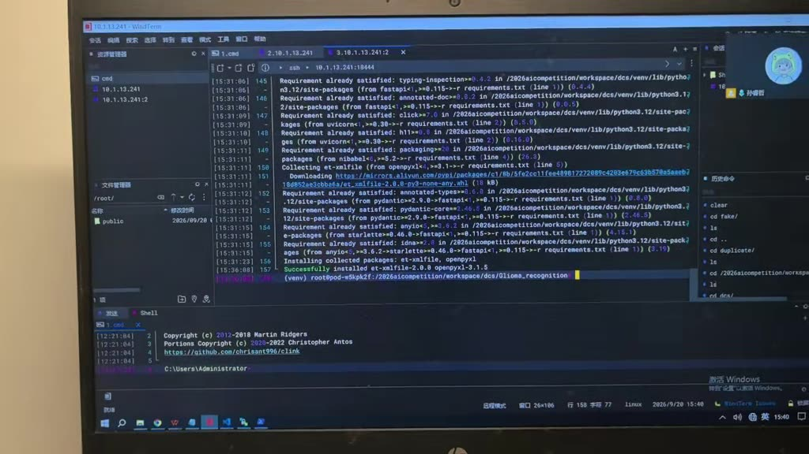

#### 装依赖报 `Error: externally-managed-environment` 怎么办

**原因**：Ubuntu 24.04 / Debian 12+ 起，系统 Python 被标记为 `externally managed`
（PEP 668），pip **拒绝直接往系统环境装包**，以免破坏系统自带的包管理。
训推平台容器（`pytorch:*-cuda*-runtime`）正是这类系统 Python。

三个办法，任选其一：

**A. 加一个参数（最快，一条命令）**

```bash
pip install --break-system-packages -r glioma_track4/requirements.txt   # ← 运行期依赖
```

> **为什么这里安全**：这些包**不含 torch**（由平台镜像提供；`numpy`/`scipy`
> 等系统已有会被跳过），不会动到镜像自带的 torch —— 装出来的都是纯 Python 小包。
>
> **为什么是 glioma_track4 而不是 Glioma_recognition-main 的 requirements**：
> 测评容器的启动命令跑的是 `glioma_track4/scripts/06_platform_serve.sh`，
> 也就是 **glioma_track4 的代码**（`src.serving.app`）。只装提交工程那份 5 个包，
> 容器会在 `import requests`（回调平台）或 `import SimpleITK`（重采样）上**直接崩**。

**B. 用本工程的环境脚本（会自动识别并处理）**

```bash
cd /2026aicompetition/workspace/dcs/glioma_track4
bash scripts/00_setup_env.sh --mode system
```

这个脚本会：沿用镜像自带 torch → 只装缺失的轻量依赖
（`--upgrade-strategy only-if-needed`，不动已有版本）→ 最后做一次依赖自检。
检测到 PEP 668 时会自动补 `--break-system-packages` 并打印一行提示。

**C. 建 venv（最干净，适合长期使用）**

```bash
python3 -m venv --system-site-packages /2026aicompetition/workspace/common/venv
source /2026aicompetition/workspace/common/venv/bin/activate
pip install -r glioma_track4/requirements.txt

# 以后再进容器，先激活：
source /2026aicompetition/workspace/common/venv/bin/activate
```

> `--system-site-packages` 让 venv **复用镜像自带的 torch**，不必重装 2GB+；
> venv 放在 `workspace` 下所以会持久保留。
>
> ⚠️ **venv 只对交互式训练/调试有效**：测评容器的启动命令是
> `bash .../06_platform_serve.sh`，它内部调用的是**系统 `python3`**，
> 不会自动进入 venv。想让测评容器用 venv，得把它的 bin 目录加进 PATH
> 或直接写进启动命令（`source .../venv/bin/activate && bash 06_platform_serve.sh`）。
> **最稳的做法**：依赖装进系统环境（方案 A / B），别让评测依赖一个可能被忘记激活的 venv。

**验证装好了**（与 `06_platform_serve.sh` 的启动自检同一份清单，缺谁装谁）：

```bash
python -c "import fastapi, uvicorn, pydantic, requests, yaml, pandas, numpy, scipy, nibabel, SimpleITK, skimage, openpyxl; print('依赖 OK')"
python -c "import torch; print('torch', torch.__version__, 'cuda', torch.cuda.is_available())"
```

**自检**（三条都通过再往下）：

```bash
# 1) GPU 可见
python -c "import torch; print(torch.cuda.is_available(), torch.cuda.device_count())"

# 2) 找到数据集与折划分
cd glioma_goals && python -c "
import sys; sys.path.insert(0,'.')
from pathlib import Path
from shared.data import discover_cases, split_train_val
root = Path('$GLIOMA_DATASET_ROOT')
cases = discover_cases(root); print('病例数', len(cases))
tr, va, src = split_train_val(cases, {'train':{'fold':0},'data':{}}, root,
                              Path('goal1_authenticity').resolve(), 42)
print(f'划分来源={src}  train={len(tr)} val={len(va)}')
"
#    期望：划分来源=folds（显示 ratio 说明没找到 folds.json，指标将不可比）

# 3) 快速冒烟（小样本，几分钟）
cd goal1_authenticity && python train.py --limit 6 --epochs 2 --tag smoke
```

冒烟成功的标志：

```
[data] 验证集 = 统一折划分 ...      ← 或"按 val_ratio 自行划分"（冒烟时正常）
[smoke] epoch 0 special=... | auc=...
[train] 已保存 .../runs/smoke/checkpoints/best.pth（best=..., epoch=0）
```

### 4.0.1 训练模态判别兜底模型（1 分钟，正式评测前必做）

**为什么必须有**：官方训练集给了 `labels/3_serieslabel.xlsx`，**评测集不给任何标注**，
序列目录名是 DICOM UID —— 按名字认模态的路径在评测期**完全失效**。认不出模态：
训练侧直接崩「无任何可用序列」，推理侧更隐蔽 —— 要先知道"哪个序列是 T1C"才能
把掩膜**写回它的空间**，认不出就写不回去，提交上去的掩膜空间是错的。

仓库里已随代码带一份 `data/modality_model.json`（本地模拟集训练，~2KB，5 折 0.96），
保证"开箱即通"；但它与官方数据存在**域差**，正式评测前请用官方训练集覆盖重训：

```bash
cd /2026aicompetition/workspace/dcs/glioma_track4
python scripts/31_train_modality_model.py --root "$GLIOMA_DATASET_ROOT"   # 覆盖 data/modality_model.json
#   只想看精度不写文件：加 --dry-run（打印 5 折准确率 + 混淆矩阵 + 特征权重）
```

判别依据是**物理量**不是黑盒：T2 的脑脊液亮（`bright_frac`）、FLAIR 的脑脊液被抑制
（`dark_frac`）、T1CE 的增强灶。训练完可用 `scripts/25_verify_tasks_integration.py`
第 ⑱ 段复核（用**训练未见过**的病例做行为级断言）。

> ⚠️ 这个文件是 `/data/` 下**唯一**入库的文件（`.gitignore` 里 `!/data/modality_model.json`）。
> 别用 `rm -rf data/` 清理产物 —— 会把兜底模型一起删掉（重新 clone 或重训可恢复）。

### 4.1 正式训练

**一个人串行做**（推荐，指标口径一致）：

```bash
cd /2026aicompetition/workspace/dcs/glioma_goals
for g in goal1_authenticity goal2_stitched goal2_duplicate \
         goal3_tumor goal4_diagnosis goal5_segmentation; do
  echo "=== $g ==="
  (cd $g && python train.py --tag exp1 --fold 0)
done
```

**五个人并行做**：

```bash
cd glioma_goals/goal5_segmentation && CUDA_VISIBLE_DEVICES=0 python train.py --tag exp1 --fold 0
cd glioma_goals/goal1_authenticity && CUDA_VISIBLE_DEVICES=1 python train.py --tag exp1 --fold 0
```

> **两种做法都用同一份 `folds.json`**（见 4.0），这样六个 Goal 的指标可比、
> 权重可合并。日志出现 `⚠️ 未找到可用折划分` 就说明没接上。

### 4.2 训练期间怎么看进度

**方式 A**：训练前台打印 `epoch` / 损失
**方式 B**：平台 **容器实例 → 点实例 ID → 监控 / 日志**。
容器信息页 **4 个 Conditions 都为 true** 表示容器健康。

### 4.3 训练完成后导出权重

```bash
cd /2026aicompetition/workspace/dcs/glioma_goals
TAG=exp1 bash scripts/export_to_submission.sh
```

期望输出：

```
  goal1_authenticity   ✓ → goal1_authenticity/model.pt（1 个分类头 / arch=mednext / in_ch=4）
  goal2_stitched       ✓ → goal2_stitched/model.pt
  goal2_duplicate      ✓ → goal2_duplicate/encoder.pt
  goal3_tumor          ✓ → goal3_tumor/model.pt
  goal4_diagnosis      ✓ → goal4_diagnosis/model.pt（14 个分类头）
  goal5_segmentation   ✓ → core.pt flair.pt
成功 6 个 / 缺失 0 个
```

> 权重默认写到 `/2026aicompetition/workspace/checkpoint/`（规范 §5.2 位置）。
> 导出脚本会**校验权重元信息**（`model_ema`/`cls_spec`/`arch`/`model_cfg`）。
> 报"元信息不完整"时**不要继续** —— 缺了它推理侧会静默加载错误结构。

---

## 5. 第 7 步：创建测评容器并提交

### 5.1 测评容器的两个硬要求

平台会**持续探测测评容器的 8000 端口和 `/health`**。不满足则容器**无法成功启动**：

| 要求 | 本工程是否满足 | 在哪实现 |
|---|---|---|
| 监听 **8000** 端口 | ✅ | `Glioma_recognition-main/start.sh`、`glioma_track4/scripts/06_platform_serve.sh` |
| 提供 **`/health`** | ✅ | `Glioma_recognition-main/app/server.py` |
| Dockerfile `EXPOSE 8000` | ✅ | `Glioma_recognition-main/Dockerfile` |

### 5.2 创建测评容器

**路径**：AI开发 → 容器实例 → 添加实例 → 实例类型选 **测评容器**

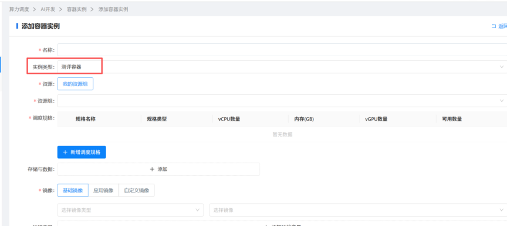

> ⚠️ **单租户最多 1 个测评容器**。创建前建议先清理训练容器腾配额
> （**先确认数据都在 workspace 下**）。

**启动命令**填：

```bash
bash /2026aicompetition/workspace/dcs/glioma_track4/scripts/06_platform_serve.sh
```

这个脚本会：① 自动发现权重（`checkpoint/<goal>/`，多折自动集成）；
② 设 `GLIOMA_LOADER_TOLERANT=1`（单个脏文件不会让整批评测失败）；
③ 以 8000 端口启动服务并保持 `/health` 常活。

**启动后自检**（容器内执行）：

```bash
curl -s http://127.0.0.1:8000/health     # 期望 200 与健康信息
```

### 5.3 发起测评

**验证测评**（先跑，**每天 5 次**）：
赛事管理平台 → 个人工作台 → 初赛阶段 → 验证测评 → 发起验证测评

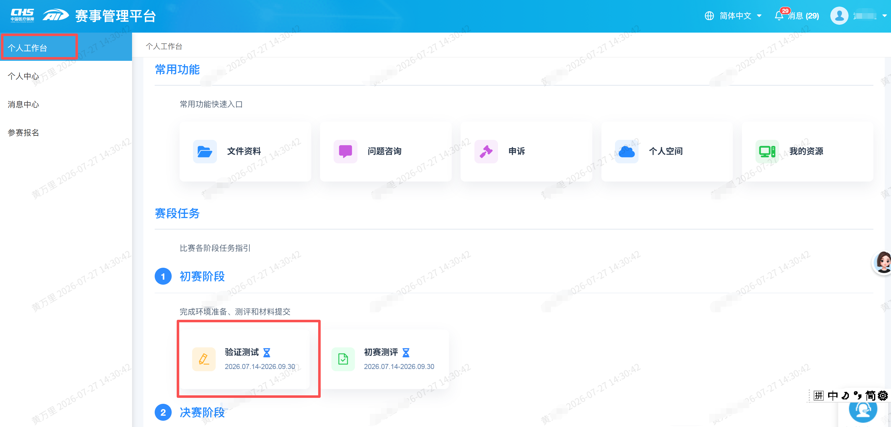

**初赛测评**（正式，**每赛道只一次**）：

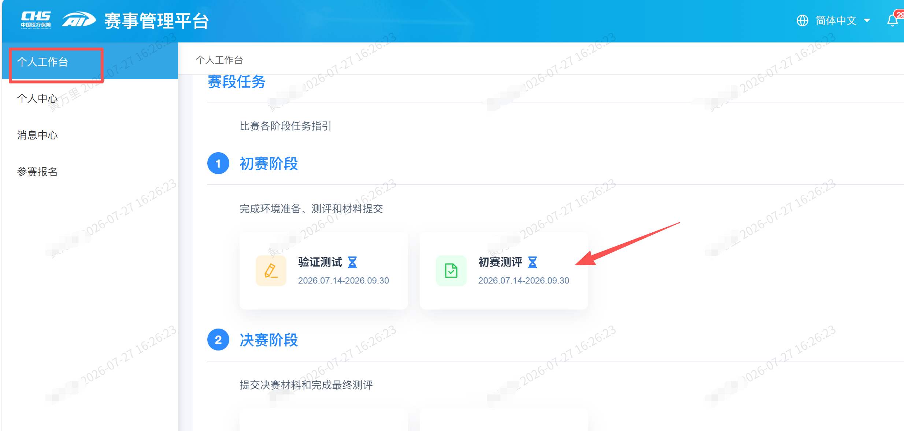

> ⚠️ **发起初赛测评后冻结参赛队伍在容器云的服务部署权限** —— 发起后不能再改容器配置。
> **务必先用验证测评确认无误**。初赛测评列表看不到成绩，成绩统一发布后在「我的成绩」查看。

---

## 6. 故障排查速查表

### 6.1 云桌面

| 现象 | 解决 |
|---|---|
| 装不上客户端 | 系统不支持（Win7 / Intel Mac）；关闭杀毒软件与防火墙 |
| "无效的服务器地址" | 地址必须完全一致 `https://ybystds.ybj.gxzf.gov.cn:30037`；关 VPN/代理；公司网络可能需白名单 |
| "原密码错误" | 密码与赛事管理平台必须一致 |
| 看不到桌面 | 首次绑定需 5-10 秒，点右上角 🔄 刷新 |
| 进不去桌面 | cmd 执行 `Test-NetConnection ybystds.ybj.gxzf.gov.cn -Port 3478` 与 `-Port 9090`，两个都要通 |
| 点了连接不弹桌面 | ① 一般 5 秒；② 有独显则删除环境变量 `DISABLE DEVICE` |
| 断连/卡顿 | 悬浮球 → 状态监测：**延迟 >200ms 或丢包 >50% 会断连**；改用有线网 |
| 锁屏 | 密码 `Admin@123` |

### 6.2 训推平台

| 现象 | 解决 |
|---|---|
| 在家打不开训推平台 | **它是内网服务** → 必须从云桌面里访问 |
| 找不到平台入口 | 见 §3.0 的三条途径；最稳妥是「问题咨询」问组委会 |
| 创建不了新实例 | 已达**每队每赛道 4 个**上限 → 清理冗余容器（先备份 workspace） |
| 容器启动失败 / Conditions 不为 true | 点实例 ID 看事件日志；**测评容器**要确认 8000 与 `/health` 已就绪 |
| 重启后代码/权重不见 | 存到了容器内而非 `/2026aicompetition/workspace/` |
| 镜像推不上去 | 自签名证书必须加 `--insecure`：`crane push --insecure <tar> <仓库>/<项目>/<镜像>:<tag>` |
| `UNAUTHORIZED` | `crane auth login <仓库地址> -u <用户名> -p "<密码>"` |

### 6.3 训练（本工程）

| 现象 | 解决 |
|---|---|
| `⚠️ 未找到可用折划分` | 没设 `GLIOMA_FOLDS`，或文件与数据对不上 → 各 Goal 指标将不可比 |
| `FileNotFoundError: 缺折划分` | 把 `glioma_track4/data/folds.json` 复制进容器并设 `GLIOMA_FOLDS` |
| 训练跑完 `checkpoints/` 是空的 | 旧版本 bug（选择指标为 `nan` 时不保存）已修复；若复现请回报 |
| `CUDA out of memory` | 减小 `--batch-size`；或 `export PYTORCH_CUDA_ALLOC_CONF=expandable_segments:True` |
| 目标四损失恒为 0 | 数据缺 `label.json` —— 属数据限制，非代码问题 |
| 验证指标 `nan` | 该折验证集无正样本（目标一/二/三正样本极稀疏），属已知数据限制 |

### 6.4 提交

| 现象 | 解决 |
|---|---|
| 测评容器起不来 | 8000 没监听 / `/health` 不可达 → 先 `curl http://127.0.0.1:8000/health` |
| 找不到权重 | `checkpoint/<goal>/` 下没有 `.pt` → 跑 `export_to_submission.sh` |
| `/call` 返回 409 | 上一个评测还在跑，等它结束或换 workspace |
| 答案目录缺某例 | 旧版本会让探针扫不到的病例没有答案（已修） |

---

## 7. 提交前检查清单

```bash
cd /2026aicompetition/workspace/dcs/glioma_track4
bash scripts/23_pre_submit_check.sh              # 提交前检查（全绿才提交）
python scripts/25_verify_tasks_integration.py    # 训练↔推理对接
python scripts/26_audit_plugin_completeness.py   # 结构 + API + 同源
```

- [ ] 六个 Goal 训练完成，`runs/<tag>/checkpoints/best.pth` 都在
- [ ] `data/modality_model.json` 已用官方训练集重训（见 4.0.1）且**随代码入库**
      （`bash scripts/23_pre_submit_check.sh` ⑧ 段会检查；被 `.gitignore` 吞掉则评测期模态全判不出）
- [ ] 容器内依赖自检通过：启动 `06_platform_serve.sh` 时打印「缺失依赖: 无 ✓」
      （自检清单含 torch/numpy/scipy/nibabel/SimpleITK/skimage/pandas/yaml/requests/fastapi/uvicorn/pydantic/openpyxl）
- [ ] Codeup 上推的是 **3 个自建工程**：`glioma_goals`（训练）/ `glioma_track4`（算法+启动脚本）
      / `Glioma_recognition-main`（提交工程）；**组委会的参考实现 `AIRecongition` 不入库**
      （无任何代码依赖它，只作协议约定来源；入库存放会增大 clone 体积且引起来源混淆）
- [ ] `export_to_submission.sh` 输出「成功 6 个 / 缺失 0 个」
- [ ] `checkpoint/<goal>/` 下权重文件齐全
- [ ] `curl http://127.0.0.1:8000/health` 返回 200
- [ ] 平台容器信息页 **4 个 Conditions 全为 true**
- [ ] 已用**验证测评**跑通至少一次
- [ ] 数据、代码、权重都在 `/2026aicompetition/workspace/` 下
- [ ] 确认不再改容器配置后，再发起**初赛测评**

---

## 8. 一页速查（打印版）

```
【赛事管理平台】https://ybystds.ybj.gxzf.gov.cn:30037
  文件资料 → 下云桌面客户端        我的资源 → 申请算力/云桌面/存储
  验证测评 → 每天 5 次              初赛测评 → 只 1 次，发起后冻结部署权限
  问题咨询 → 找不到训推平台入口就问这里

【云桌面】账号密码 = 赛事平台账号密码
  服务地址 https://ybystds.ybj.gxzf.gov.cn:30037
  锁屏密码 Admin@123     关杀毒 / 用网线 / 关 VPN
  悬浮球：状态监测（延迟>200ms 断连）/ 全屏 / 断开

【训推平台】内网服务 —— 必须从云桌面访问（视频里叫「开发管理平台」）
  判断进对了：左侧有 AI资产 / AI开发 / AI资源 / 算力调度
  容器实例：AI开发 → 容器实例 → 添加实例（每队每赛道 ≤4 个）
  存储：AI资产 → 存储与数据服务（公共=只读，我的=读写）
  容器内持久目录：/2026aicompetition/workspace/
  测评容器：单租户 ≤1 个，必须 8000 端口 + /health

【训练】
  export GLIOMA_FOLDS=/2026aicompetition/workspace/common/folds.json
  cd glioma_goals/<goal> && python train.py --tag exp1 --fold 0
  TAG=exp1 bash ../scripts/export_to_submission.sh

【提交】
  bash glioma_track4/scripts/06_platform_serve.sh    # 启动服务（8000 + /health）
  curl http://127.0.0.1:8000/health                  # 自检
  赛事平台 → 验证测评 → 确认 → 初赛测评
```

---

> **本指南与工程代码的一致性**：文中所有路径、端口、脚本名都取自当前仓库实际内容
> （`start.sh` 的 8000 端口、`app/server.py` 的 `/health`、`export_to_submission.sh`
> 的导出规则、`06_platform_serve.sh` 的权重发现逻辑）。改动这些文件时请同步更新本指南。
>
> 截图可用 `python scripts/27_extract_platform_docs.py` +
> `python scripts/28_collect_platform_images.py` 从三份官方 docx 重新生成。
